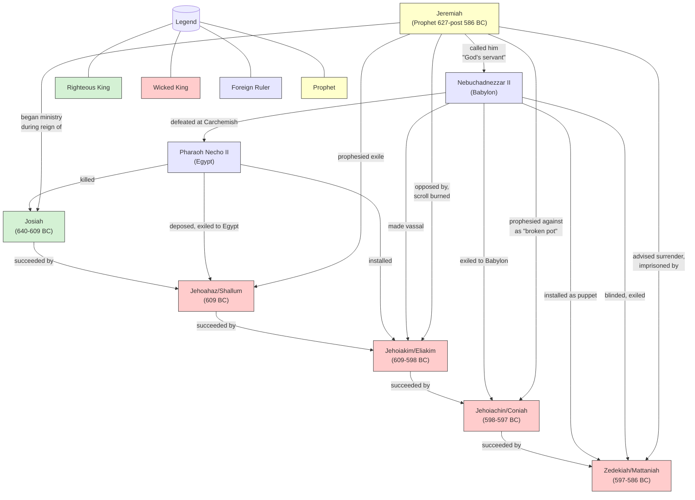
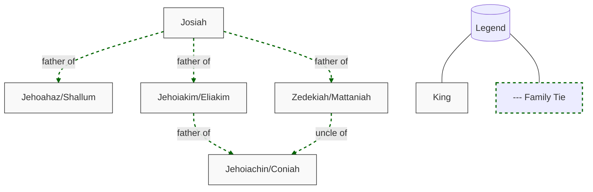
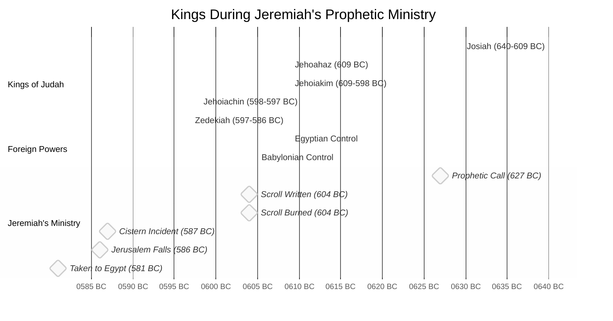

# Kings in Jeremiah's Narrative - Relationship Diagram

## Political and Prophetic Relationships

## Family Relationships

## Timeline Overview

## Key Relationships in Jeremiah's Ministry

1. **Jeremiah and Josiah**: Compatible relationship - both working toward religious reform
2. **Jeremiah and Jehoiakim**: Antagonistic relationship - direct opposition and persecution
3. **Jeremiah and Zedekiah**: Complex relationship - Zedekiah sought counsel but lacked courage to follow it
4. **Jeremiah and Nebuchadnezzar**: Theological relationship - interpreted Babylon as God's instrument of judgment

## Impact on Jeremiah's Message

The succession of kings significantly influenced Jeremiah's prophetic message:

- Under **Josiah**: Messages focused on hope for reform and averting judgment
- Under **Jehoiakim**: Warnings intensified, focus on coming judgment
- Under **Jehoiachin**: Brief but severe pronouncements about dynastic termination
- Under **Zedekiah**: Emphasis on surrender to Babylon as God's will, followed by future restoration