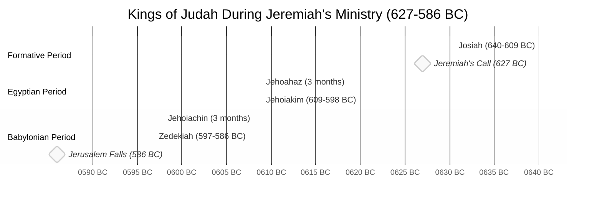

# Kings in Jeremiah's Narrative

## Overview of Kings During Jeremiah's Ministry

Jeremiah's prophetic ministry spanned approximately from 627 BC to after 586 BC, covering the reigns of Judah's final kings before the Babylonian exile.

## Roles of Kings in Jeremiah's Narrative

### Josiah (640-609 BC)
- Called to prophetic ministry during Josiah's 13th year (627 BC)
- Witnessed Josiah's religious reforms
- Supported the king's religious revival
- Mourned Josiah's death at Megiddo (609 BC)
- Referenced in Jeremiah 1:2, 3:6, 22:15-16, 25:3

### Jehoahaz/Shallum (609 BC)
- Brief 3-month reign
- Taken captive to Egypt
- Jeremiah prophesied he would never return (Jeremiah 22:10-12)

### Jehoiakim (609-598 BC)
- Major antagonist to Jeremiah's ministry
- Cut and burned Jeremiah's scroll (Jeremiah 36:21-26)
- Persecuted and threatened Jeremiah's life
- Rebelled against Babylon after being vassal
- Jeremiah prophesied his disgraceful death (Jeremiah 22:18-19, 36:30)
- Arrested and imprisoned Jeremiah multiple times

### Jehoiachin/Coniah/Jeconiah (598-597 BC)
- Very brief 3-month reign
- Surrendered Jerusalem to Nebuchadnezzar
- Exiled to Babylon with 10,000 others
- Jeremiah prophesied against him as a "despised, broken pot" (Jeremiah 22:24-30)
- Declared childless regarding the throne (dynasty terminated)

### Zedekiah (597-586 BC)
- Last king of Judah, installed by Nebuchadnezzar
- Initially sought Jeremiah's counsel but lacked courage to follow it
- Vacillated between protecting and imprisoning Jeremiah
- Had Jeremiah rescued from the cistern but kept imprisoned (Jeremiah 38:7-13)
- Ignored Jeremiah's warnings not to rebel against Babylon
- Witnessed his sons killed before being blinded (Jeremiah 39:6-7)
- Jerusalem destroyed during his reign

## Foreign Kings in Jeremiah's Narrative

### Pharaoh Necho II (Egypt)
- Killed King Josiah at Megiddo (609 BC)
- Deposed Jehoahaz and installed Jehoiakim
- Initially controlled Judah as a vassal state
- Later defeated by Nebuchadnezzar at Carchemish (605 BC)

### Nebuchadnezzar II (Babylon)
- Major figure in Jeremiah's prophecies
- Called God's "servant" for executing judgment (Jeremiah 25:9, 27:6)
- Conducted three major deportations (605, 597, 586 BC)
- Appointed Zedekiah as vassal king
- Destroyed Jerusalem and the Temple in 586 BC
- Later appointed Gedaliah as governor
- Gave orders to protect Jeremiah (Jeremiah 39:11-12)

## Timeline of Key Events

| Year (BC) | King | Event in Jeremiah's Narrative |
|-----------|------|--------------------------------|
| 627 | Josiah | Jeremiah called to prophetic ministry (Jer 1:2) |
| 622 | Josiah | Book of the Law found, reforms intensified |
| 609 | Josiah | Died in battle at Megiddo against Egypt |
| 609 | Jehoahaz | Brief reign, taken captive to Egypt |
| 605 | Jehoiakim | First deportation to Babylon, including Daniel |
| 605 | Jehoiakim | Battle of Carchemish - Babylon defeats Egypt |
| 604 | Jehoiakim | Jeremiah dictates scroll to Baruch |
| 601 | Jehoiakim | Jehoiakim rebels against Babylon |
| 598 | Jehoiakim | Dies during Babylonian siege |
| 597 | Jehoiachin | Second deportation, Jehoiachin exiled |
| 593 | Zedekiah | False prophet Hananiah opposes Jeremiah |
| 588 | Zedekiah | Zedekiah rebels, Jerusalem besieged |
| 587 | Zedekiah | Jeremiah imprisoned, rescued from cistern |
| 586 | Zedekiah | Jerusalem falls, Temple destroyed, third deportation |
| 582 | None | Final small deportation to Babylon |
| 581 | None | Jeremiah taken to Egypt by refugees |