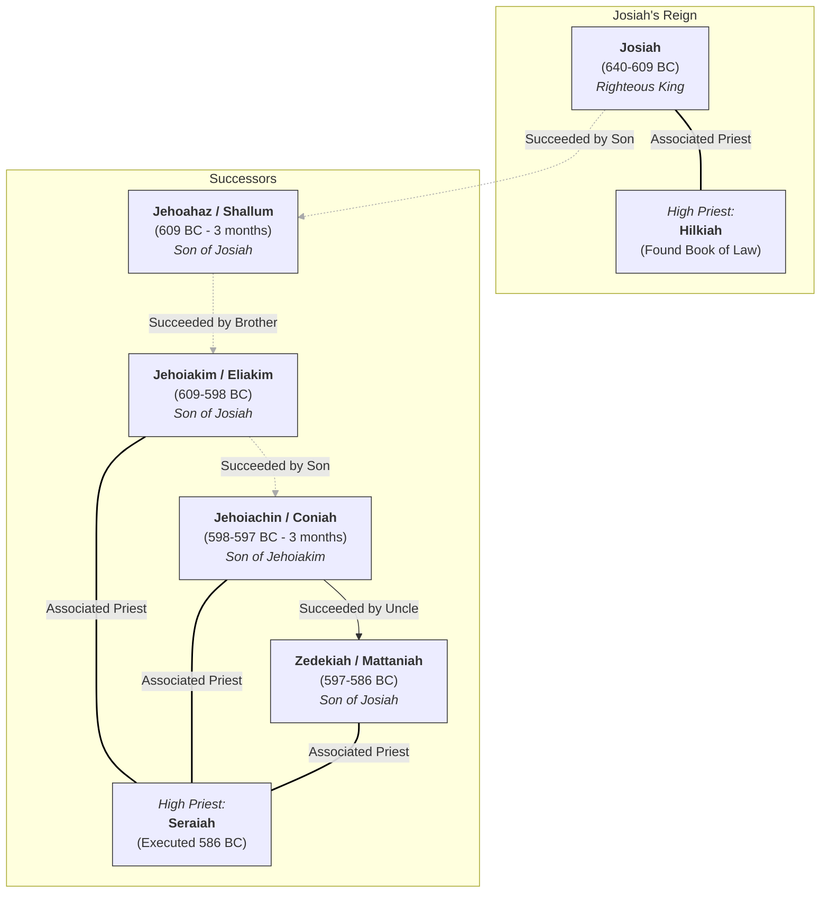

# Kings of Judah: Timeline, Family, and High Priests (Jeremiah's Era)

This diagram shows the chronological order of the last five kings of Judah, their family relationships, and the High Priests serving during their reigns, corresponding to the time of the prophet Jeremiah.

**Key Points:**

*   **Succession:** Note the non-linear succession after Josiah: son -> brother -> nephew -> uncle.
*   **High Priests:** Hilkiah is strongly associated with Josiah's reforms. Seraiah was the High Priest during the final turbulent years and the fall of Jerusalem.
*   **Family:** All the last four kings were related: three were sons of Josiah, and one was his grandson.