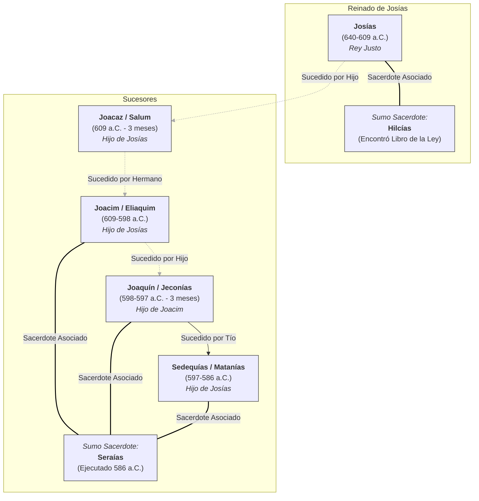

# Reyes de Judá: Cronología, Familia y Sumos Sacerdotes (Era de Jeremías)

Este diagrama muestra el orden cronológico de los últimos cinco reyes de Judá, sus relaciones familiares y los Sumos Sacerdotes que sirvieron durante sus reinados, correspondientes a la época del profeta Jeremías.

**Puntos Clave:**

*   **Sucesión:** Nótese la sucesión no lineal después de Josías: hijo -> hermano -> sobrino -> tío.
*   **Sumos Sacerdotes:** Hilcías está fuertemente asociado con las reformas de Josías. Seraías fue el Sumo Sacerdote durante los turbulentos años finales y la caída de Jerusalén.
*   **Familia:** Los últimos cuatro reyes estaban emparentados: tres eran hijos de Josías y uno era su nieto.