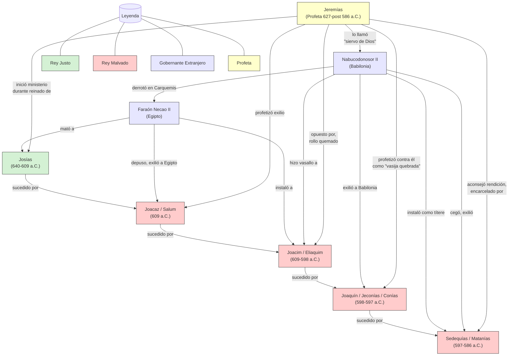
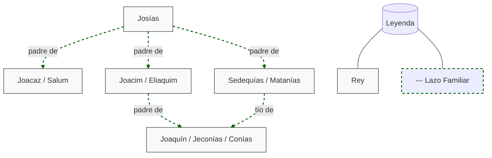
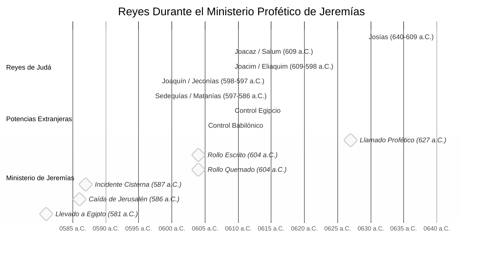

# Reyes en la Narrativa de Jeremías - Diagrama de Relaciones

## Relaciones Políticas y Proféticas

## Relaciones Familiares

## Panorama Cronológico

## Relaciones Clave en el Ministerio de Jeremías

1.  **Jeremías y Josías**: Relación compatible - ambos trabajaban por la reforma religiosa
2.  **Jeremías y Joacim**: Relación antagónica - oposición directa y persecución
3.  **Jeremías y Sedequías**: Relación compleja - Sedequías buscó consejo pero careció de valor para seguirlo
4.  **Jeremías y Nabucodonosor**: Relación teológica - interpretó a Babilonia como instrumento de juicio de Dios

## Impacto en el Mensaje de Jeremías

La sucesión de reyes influyó significativamente en el mensaje profético de Jeremías:

-   Bajo **Josías**: Mensajes centrados en la esperanza de reforma y evitar el juicio
-   Bajo **Joacim**: Advertencias intensificadas, enfoque en el juicio venidero
-   Bajo **Joaquín**: Pronunciamientos breves pero severos sobre la terminación dinástica
-   Bajo **Sedequías**: Énfasis en la rendición a Babilonia como voluntad de Dios, seguido de restauración futura