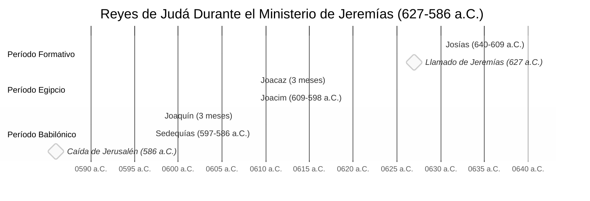

# Reyes en la Narrativa de Jeremías

## Panorama de los Reyes Durante el Ministerio de Jeremías

El ministerio profético de Jeremías se extendió aproximadamente desde el 627 a.C. hasta después del 586 a.C., cubriendo los reinados de los últimos reyes de Judá antes del exilio babilónico.

## Roles de los Reyes en la Narrativa de Jeremías

### Josías (640-609 a.C.)
- Jeremías fue llamado al ministerio profético durante el año 13 de Josías (627 a.C.)
- Presenció las reformas religiosas de Josías
- Apoyó el avivamiento religioso del rey
- Lamentó la muerte de Josías en Meguido (609 a.C.)
- Referenciado en Jeremías 1:2, 3:6, 22:15-16, 25:3

### Joacaz / Salum (609 a.C.)
- Breve reinado de 3 meses
- Llevado cautivo a Egipto
- Jeremías profetizó que nunca regresaría (Jeremías 22:10-12)

### Joacim / Eliaquim (609-598 a.C.)
- Principal antagonista del ministerio de Jeremías
- Cortó y quemó el rollo de Jeremías (Jeremías 36:21-26)
- Persiguió y amenazó la vida de Jeremías
- Se rebeló contra Babilonia después de ser vasallo
- Jeremías profetizó su muerte deshonrosa (Jeremías 22:18-19, 36:30)
- Arrestó y encarceló a Jeremías varias veces

### Joaquín / Jeconías / Conías (598-597 a.C.)
- Reinado muy breve de 3 meses
- Rindió Jerusalén a Nabucodonosor
- Exiliado a Babilonia con otros 10,000
- Jeremías profetizó contra él como una "vasija despreciada y quebrada" (Jeremías 22:24-30)
- Declarado sin hijos respecto al trono (dinastía terminada)

### Sedequías / Matanías (597-586 a.C.)
- Último rey de Judá, instalado por Nabucodonosor
- Inicialmente buscó el consejo de Jeremías pero careció de valor para seguirlo
- Vaciló entre proteger y encarcelar a Jeremías
- Hizo rescatar a Jeremías de la cisterna pero lo mantuvo encarcelado (Jeremías 38:7-13)
- Ignoró las advertencias de Jeremías de no rebelarse contra Babilonia
- Presenció la muerte de sus hijos antes de ser cegado (Jeremías 39:6-7)
- Jerusalén destruida durante su reinado

## Reyes Extranjeros en la Narrativa de Jeremías

### Faraón Necao II (Egipto)
- Mató al rey Josías en Meguido (609 a.C.)
- Depuso a Joacaz e instaló a Joacim
- Inicialmente controló Judá como estado vasallo
- Más tarde derrotado por Nabucodonosor en Carquemis (605 a.C.)

### Nabucodonosor II (Babilonia)
- Figura principal en las profecías de Jeremías
- Llamado "siervo" de Dios para ejecutar juicio (Jeremías 25:9, 27:6)
- Realizó tres deportaciones principales (605, 597, 586 a.C.)
- Nombró a Sedequías como rey vasallo
- Destruyó Jerusalén y el Templo en 586 a.C.
- Más tarde nombró a Gedalías como gobernador
- Dio órdenes de proteger a Jeremías (Jeremías 39:11-12)

## Cronología de Eventos Clave

| Año (a.C.) | Rey | Evento en la Narrativa de Jeremías |
|-----------|------|------------------------------------|
| 627 | Josías | Jeremías llamado al ministerio profético (Jer 1:2) |
| 622 | Josías | Se encuentra el Libro de la Ley, se intensifican las reformas |
| 609 | Josías | Muere en batalla en Meguido contra Egipto |
| 609 | Joacaz | Breve reinado, llevado cautivo a Egipto |
| 605 | Joacim | Primera deportación a Babilonia, incluyendo a Daniel |
| 605 | Joacim | Batalla de Carquemis - Babilonia derrota a Egipto |
| 604 | Joacim | Jeremías dicta el rollo a Baruc |
| 601 | Joacim | Joacim se rebela contra Babilonia |
| 598 | Joacim | Muere durante el asedio babilónico |
| 597 | Joaquín | Segunda deportación, Joaquín exiliado |
| 593 | Sedequías | Falso profeta Hananías se opone a Jeremías |
| 588 | Sedequías | Sedequías se rebela, Jerusalén sitiada |
| 587 | Sedequías | Jeremías encarcelado, rescatado de la cisterna |
| 586 | Sedequías | Cae Jerusalén, Templo destruido, tercera deportación |
| 582 | Ninguno | Última pequeña deportación a Babilonia |
| 581 | Ninguno | Jeremías llevado a Egipto por refugiados |